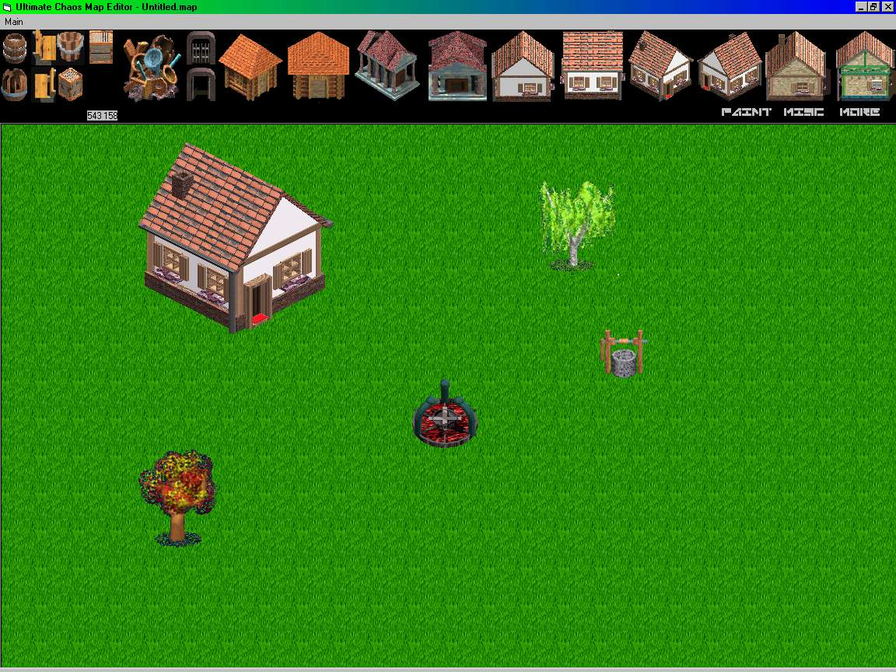



## A great map\-editor for games

### Description

With this you can make maps for rpg games with very good graphics! In this map-editor you can drag and drop or paint grass, stone, sand etc. You can place buildings, trees, barrels and other cool things! It uses bitblt. Please give comments, rate it and if you think it's bad..tell me why. Thanks!
 
### More Info
 
Might run slow on old computers...

             |
---                |---
**Submitted On**   |2001-03-31 20:20:24
**By**             |[ReXz](https://github.com/Planet-Source-Code/PSCIndex/blob/master/ByAuthor/rexz.md)
**Level**          |Beginner
**User Rating**    |4.7 (71 globes from 15 users)
**Compatibility**  |VB 6\.0
**Category**       |[Graphics](https://github.com/Planet-Source-Code/PSCIndex/blob/master/ByCategory/graphics__1-46.md)
**World**          |[Visual Basic](https://github.com/Planet-Source-Code/PSCIndex/blob/master/ByWorld/visual-basic.md)
**Archive File**   |[CODE\_UPLOAD177533312001\.zip](https://github.com/Planet-Source-Code/rexz-a-great-map-editor-for-games__1-22049/archive/master.zip)

